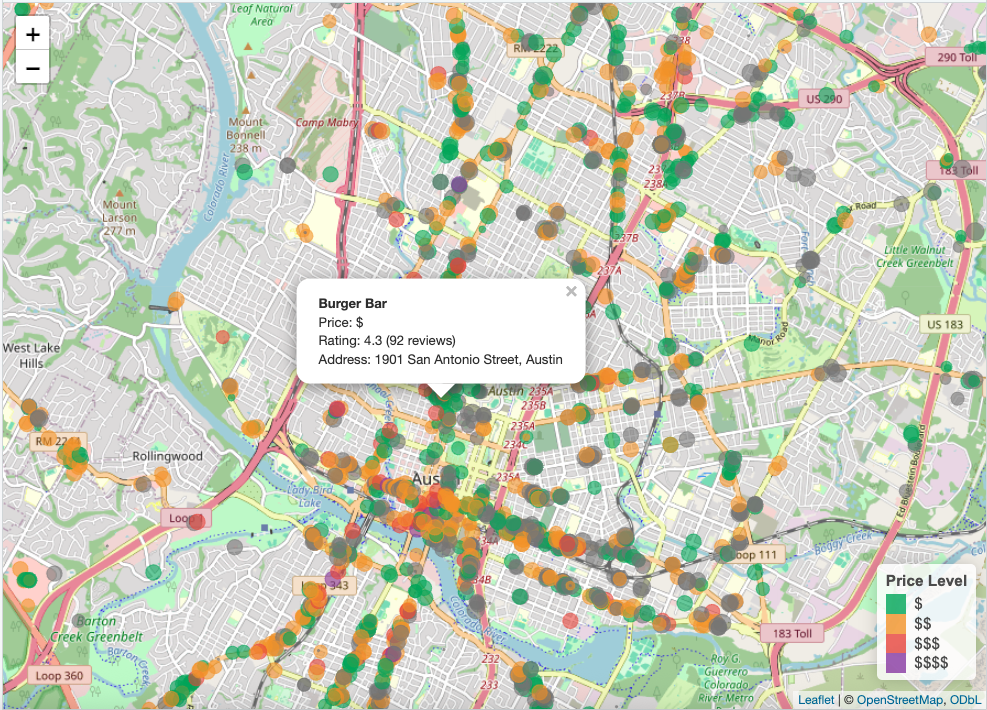

<!-- README.md is generated from README.Rmd. Please edit that file -->

```{r, include = FALSE}
knitr::opts_chunk$set(
  collapse = TRUE,
  comment = "#>",
  fig.path = "man/figures/README-",
  out.width = "100%"
)
```

# restaurant-recommender

The goal of restaurant-recommender is to build a restaurant recommendation engine for the capstone project in Unstructured Data Analytics. We are focusing on the Austin, TX area to make the analysis more tangible, fun, and relevant.  

# Example map of the underlying data
```{r,echo=FALSE}

```


## Data Source

Data was scraped via the Google Places API and stored in a sql lite database. Below are examples of accessing the data via R and Python

```{r,message=FALSE}

library(tidyverse)
library(RSQLite)

con <- dbConnect(RSQLite::SQLite(), "austin_restaurants.db")

dbListTables(con)


```

All tables join on the restaurant id which is called `id` in each table. 

```{r}

sql_example <- tbl(con,"restaurants") %>% 
  filter(business_status == "OPERATIONAL",!sql("lower(place_tags) like '%convenience%'")) %>% 
  select(name,id,rating,price_level,user_ratings_total,lat,lng,address,place_tags) %>% 
  head(10)

sql_example %>% collect() %>% print()
sql_example %>% show_query()

```

```{python,eval=FALSE}
import sqlite3
import pandas as pd
from sqlalchemy import create_engine, text

# Option 1: Using sqlite3 (built-in)
con = sqlite3.connect("austin_restaurants.db")

# List tables
cursor = con.cursor()
cursor.execute("SELECT name FROM sqlite_master WHERE type='table'")
tables = cursor.fetchall()
print("Tables:", [t[0] for t in tables])

# SQL query equivalent
query = """
SELECT 
    name,
    id,
    rating,
    price_level,
    user_ratings_total,
    lat,
    lng,
    address,
    place_tags
FROM restaurants
WHERE business_status = 'OPERATIONAL'
    AND lower(place_tags) NOT LIKE '%convenience%'
LIMIT 10
"""

sql_example = pd.read_sql_query(query, con)
print(sql_example)

con.close()

```


```{r,eval=FALSE}
library(tidyverse)
library(leaflet)
library(DBI)
library(RSQLite)

# Connect to database
con <- dbConnect(RSQLite::SQLite(), "austin_restaurants.db")

restaurants <- tbl(con, "restaurants") %>%
  filter(business_status == "OPERATIONAL") %>%
  collect() 

dbDisconnect(con)

# Create price level labels
restaurants <- restaurants %>%
  mutate(
    price_label = case_when(
      price_level == 1 ~ "$",
      price_level == 2 ~ "$$",
      price_level == 3 ~ "$$$",
      price_level == 4 ~ "$$$$",
      TRUE ~ "Unknown"
    ),
    price_color = case_when(
      price_level == 1 ~ "#27ae60",
      price_level == 2 ~ "#f39c12",
      price_level == 3 ~ "#e74c3c",
      price_level == 4 ~ "#8e44ad",
      TRUE ~ "gray"
    )
  )


leaflet(restaurants) %>%
  addTiles() %>%
  addCircleMarkers(
    lng = ~lng,
    lat = ~lat,
    radius = ~rating * 1.5,
    color = ~price_color,
    fillColor = ~price_color,
    fillOpacity = 0.6,
    stroke = TRUE,
    weight = 1,
    popup = ~paste0(
      "<b>", name, "</b><br/>",
      "Price: ", price_label, "<br/>",
      "Rating: ", rating, " (", user_ratings_total, " reviews)<br/>",
      "Address: ", address
    ),
    label = ~name
  ) %>%
  addLegend(
    position = "bottomright",
    colors = c("#27ae60", "#f39c12", "#e74c3c", "#8e44ad"),
    labels = c("$", "$$", "$$$", "$$$$"),
    title = "Price Level",
    opacity = 0.8
  )


```


