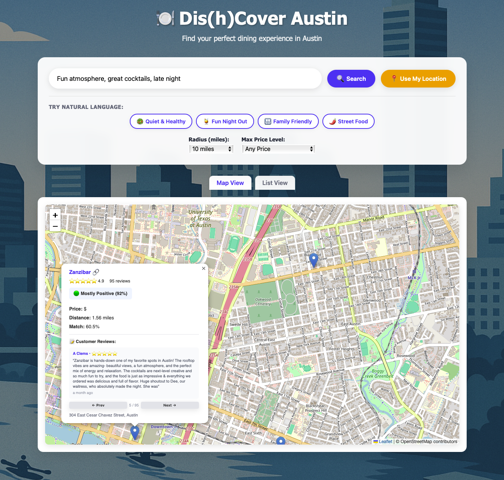

# 🍽️ Dis(h)Cover Austin

**An intelligent restaurant recommendation system for Austin, TX that uses BERT semantic search to understand natural language queries and find your perfect dining experience.**

[](https://www.python.org/downloads/)
[](https://fastapi.tiangolo.com/)
[](LICENSE)

🚀 **[Try the Live Demo](https://zac-garland-restaurant-recommender.share.connect.posit.cloud/)**

---

## 📸 Screenshots

### Landing Page

*Clean, minimal interface with location-based search*

### Search Results & Interactive Map

*Natural language search with sentiment analysis and interactive map visualization*

---

## 🎯 What Makes This Different?

Instead of traditional keyword matching, **Dis(h)Cover Austin** understands the *context and intent* behind your dining preferences using advanced NLP:

```
❌ Old way: "austin bars"
✅ New way: "Fun atmosphere, great cocktails, late night"
```

The system processes your natural language query and returns restaurants ranked by semantic similarity, not just keyword matches.

---

## ✨ Key Features

- **🔍 Semantic Search**: BERT-powered natural language understanding
- **🗺️ Interactive Map**: Leaflet.js with enhanced popups showing reviews, ratings, and distance
- **📊 Sentiment Analysis**: Real-time sentiment classification on 190,000+ reviews
- **📍 Location-Aware**: Geolocation support with radius filtering (5-20+ miles)
- **💰 Smart Filters**: Price level, rating, and distance-based filtering
- **🎨 Modern UI**: Responsive design with smooth animations and transitions
- **🎲 Feeling Lucky**: Random restaurant suggestions when you can't decide

---

## 📊 Dataset

- **2,500+ Restaurants** across Austin, TX
- **190,000+ Reviews** from real users
- **Rich Metadata**: Ratings, price levels, locations, amenities, and cuisine tags
- **Data Source**: Google Places API

---

## 🏗️ Tech Stack

### Backend
- **FastAPI** - Modern Python web framework
- **sentence-transformers** - BERT embeddings (all-MiniLM-L6-v2)
- **scikit-learn** - Cosine similarity calculations
- **pandas** - Data processing and analysis
- **SQLite** - Lightweight database

### Frontend
- **Vanilla JavaScript** - No framework dependencies
- **Leaflet.js** - Interactive mapping
- **OpenStreetMap** - Free, open-source map tiles
- **CSS3** - Advanced animations and gradients

---

## 🚀 Quick Start

### Prerequisites
- Python 3.9+
- pip (Python package manager)
- Virtual environment (recommended)

### Installation

1. **Clone the repository**
```bash
git clone https://github.com/zac-garland/restaurant-recommender.git
cd restaurant-recommender
```

2. **Create and activate virtual environment**
```bash
python -m venv env
source env/bin/activate  # On Windows: env\Scripts\activate
```

3. **Install dependencies**
```bash
pip install -r requirements.txt
```

### Running the Application

You need to run two servers in separate terminal windows:

**Terminal 1 - Backend API:**
```bash
cd backend
source ../env/bin/activate
uvicorn app:app --reload --port 8001
```
Backend will be available at: http://localhost:8001

**Terminal 2 - Frontend:**
```bash
cd frontend
python -m http.server 8000
```
Frontend will be available at: http://localhost:8000

**Open your browser** to http://localhost:8000 and start exploring!

---

## 💡 How to Use

1. **Grant Location Access** - Click the orange button to enable location-based recommendations
2. **Enter Your Query** - Describe what you're craving in natural language:
   - "Healthy plant-based brunch with gluten-free options"
   - "Late night comfort food greasy burger and fries"
   - "Authentic spicy Mexican tacos with fresh salsa"
3. **Adjust Filters** - Set your preferred radius (5-20+ miles) and price range ($-$$$$)
4. **Explore Results** - View restaurants on the interactive map or in list view
5. **Click for Details** - Select any restaurant card to jump to its map location

### Example Queries

Try these natural language searches:
- "romantic Italian dinner with wine"
- "family-friendly brunch with outdoor seating"
- "late night tacos and margaritas"
- "cozy coffee shop with wifi for laptop work"
- "upscale steakhouse for birthday celebration"

---

## 🔬 How It Works

### 1. Query Processing
```python
query = "romantic Italian dinner"
query_embedding = model.encode([query])  # Shape: (1, 384)
```

### 2. Restaurant Encoding
```python
# Combine restaurant name + cuisine tags for context
restaurant_text = "Juliet Italian Kitchen restaurant,food,bar"
restaurant_embedding = model.encode([restaurant_text])  # Shape: (1, 384)
```

### 3. Similarity Calculation
```python
similarity = cosine_similarity(query_embedding, restaurant_embedding)
# Returns: 0.63 (63% match!)
```

### 4. Ranking & Filtering
- Sort by similarity score (highest first)
- Apply distance filter using Haversine formula
- Filter by price level and rating
- Return top 10 results

---

## 🗂️ Project Structure

```
restaurant-recommender/
├── backend/
│   ├── app.py              # FastAPI backend with BERT
│   └── TEST_RESULTS.md     # Backend validation tests
├── frontend/
│   ├── index.html          # Main application interface
│   ├── styles.css          # Advanced CSS with animations
│   └── script.js           # Map, search, and UI logic
├── figures/
│   ├── landing-page.png    # Screenshot of landing page
│   └── search-results.png  # Screenshot of search results
├── austin_restaurants.db   # SQLite database (2,500 restaurants, 190K+ reviews)
├── requirements.txt        # Python dependencies
├── README.md               # This file
└── LICENSE                 # MIT License
```

---

## 📡 API Reference

### Search Endpoint

**POST** `/search`

**Request Body:**
```json
{
  "query": "romantic Italian dinner with wine",
  "user_lat": 30.2672,
  "user_lng": -97.7431,
  "radius": 10,
  "max_price": 3
}
```

**Response:**
```json
[
  {
    "id": "ChIJ...",
    "name": "Restaurant Name",
    "business_status": "OPERATIONAL",
    "price_level": 2.0,
    "rating": 4.5,
    "user_ratings_total": 500,
    "address": "123 Street, Austin, TX",
    "lat": 30.2672,
    "lng": -97.7431,
    "place_tags": "restaurant,food,bar",
    "distance": 1.23,
    "similarity": 0.645,
    "top_review": "Amazing food! The pasta was...",
    "sentiment": "Mostly Positive (92%)"
  }
]
```

### Example cURL Request

```bash
curl -X POST http://localhost:8001/search \
  -H "Content-Type: application/json" \
  -d '{
    "query": "healthy vegan brunch with gluten-free options",
    "user_lat": 30.2672,
    "user_lng": -97.7431,
    "radius": 5,
    "max_price": 2
  }'
```

---

## 📊 Database Schema

### `restaurants` table
| Column | Type | Description |
|--------|------|-------------|
| id | TEXT | Google Place ID (primary key) |
| name | TEXT | Restaurant name |
| business_status | TEXT | OPERATIONAL/CLOSED |
| price_level | REAL | 1-4 scale ($-$$$$) |
| rating | REAL | Google rating (1-5 stars) |
| user_ratings_total | INTEGER | Number of reviews |
| address | TEXT | Full street address |
| lat/lng | REAL | GPS coordinates |
| place_tags | TEXT | Comma-separated cuisine/amenity tags |

### `reviews` table
| Column | Type | Description |
|--------|------|-------------|
| id | TEXT | Restaurant ID (foreign key) |
| author_name | TEXT | Reviewer name |
| text | TEXT | Review content |
| rating | INTEGER | Review rating (1-5) |
| time | INTEGER | Unix timestamp |
| language | TEXT | Review language |

---

## ⚡ Performance

- **Response Time**: ~500-800ms per search
- **Similarity Range**: 0.25-0.70 (25%-70% match)
- **Model**: all-MiniLM-L6-v2 (22M parameters, 384 dimensions)
- **First Run**: Downloads BERT models (~500MB)
- **Memory**: ~2GB RAM recommended

---

## 🔧 Troubleshooting

### Backend won't start
```bash
# Ensure you're in the virtual environment
source env/bin/activate

# Check if port 8001 is available
lsof -i :8001
```

### Frontend shows "Search failed"
```bash
# Verify backend is running
curl http://localhost:8001/

# Check browser console for CORS errors
```

### No results returned
- Try a simpler query first (e.g., "pizza")
- Increase radius filter to 20+ miles
- Remove price filter constraints

### Map not showing markers
- Ensure restaurants have valid lat/lng coordinates
- Check browser console for JavaScript errors

---

## 🔄 Project Evolution

This project evolved through several iterations as part of a capstone project for Unstructured Data Analytics:

1. **V1**: R Shiny implementation with tidyverse and text mining
2. **V2**: Python Shiny conversion for course/team requirements
3. **V3**: FastAPI + vanilla JavaScript rebuild for production deployment

The current version (V3) represents a complete architectural redesign focused on performance, scalability, and user experience.

---

## 🎯 Future Enhancements

- [ ] Cache BERT embeddings for faster responses
- [ ] Add pagination for >10 results
- [ ] Implement fuzzy matching for typos
- [ ] Add cuisine type dropdown filters
- [ ] Time-based filtering (breakfast/lunch/dinner hours)
- [ ] User accounts and favorite restaurants
- [ ] Collaborative filtering recommendations
- [ ] Mobile app (React Native)

---

## 🤝 Contributing

Contributions are welcome! Here's how you can help:

1. Fork the repository
2. Create a feature branch (`git checkout -b feature/amazing-feature`)
3. Make your changes
4. Test thoroughly
5. Commit your changes (`git commit -m 'Add amazing feature'`)
6. Push to the branch (`git push origin feature/amazing-feature`)
7. Open a Pull Request

---

## 📄 License

This project is licensed under the MIT License - see the [LICENSE](LICENSE) file for details.

---

## 🙏 Acknowledgments

- **Google Places API** for restaurant data
- **Sentence Transformers** for BERT embeddings
- **OpenStreetMap** for free map tiles
- **Austin food scene** for endless inspiration 🌮

---

## 👨‍💻 Author

**Zac Garland**

- LinkedIn: [linkedin.com/in/zacgarland](https://www.linkedin.com/in/zacgarland)
- GitHub: [@zac-garland](https://github.com/zac-garland)
- Portfolio: Master's in Financial Business Analytics, University of Texas at Austin

**Group**

- Raghuraman
- Darius Hajibashi
- Gabriel Sanders
- Keenan J Hui
- Stephanie Coutts
- Andy K

---

## 📞 Contact & Support

Questions? Suggestions? Found a bug?

- Open an issue on GitHub
- Connect with me on LinkedIn
- Check out the [live demo](https://zac-garland-restaurant-recommender.share.connect.posit.cloud/)

---

<div align="center">

**Built with ❤️ using BERT, FastAPI, and lots of Austin tacos 🌮**

⭐ Star this repo if you found it helpful!

</div>
